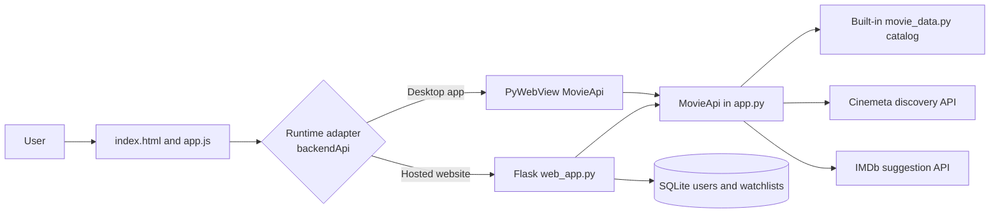
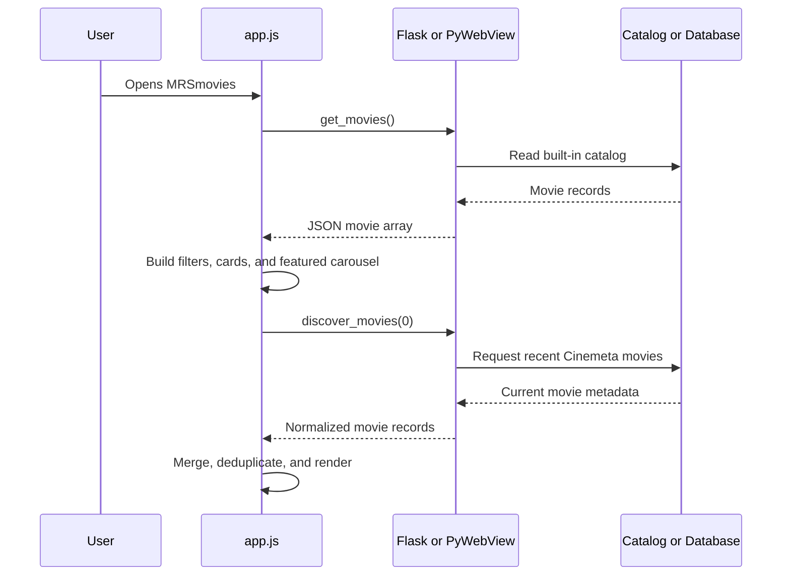
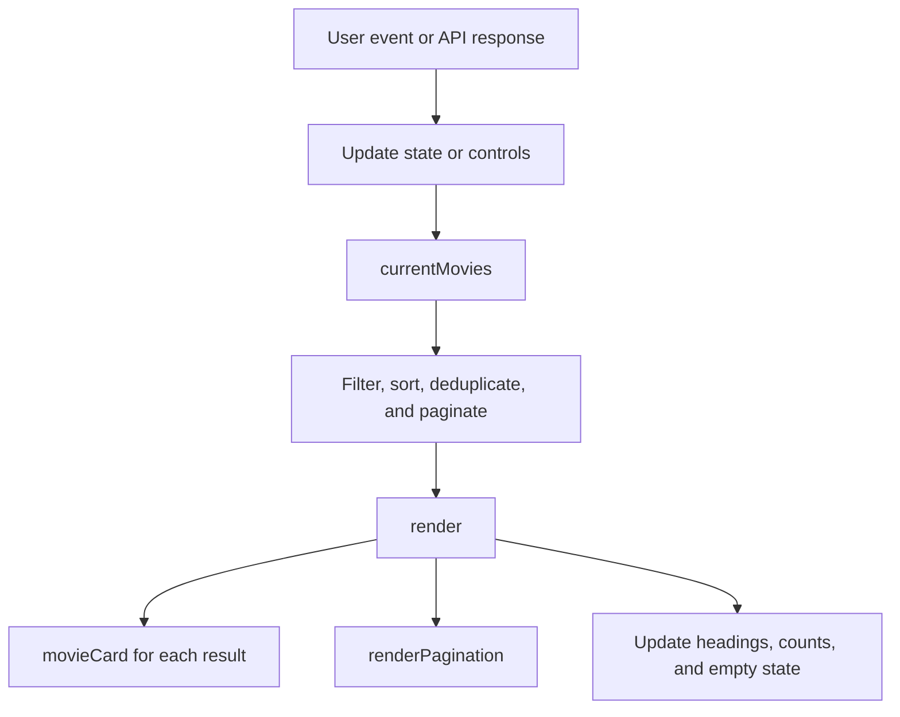
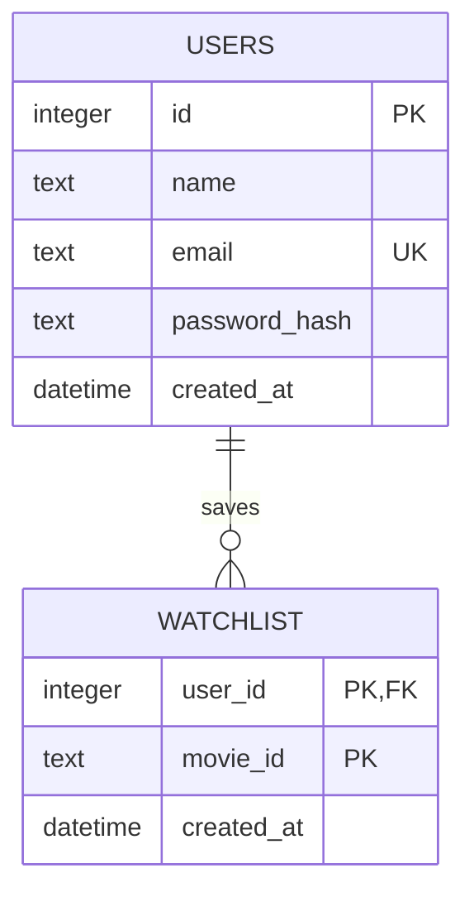

# MRSmovies Presentation and Code Guide

This document is both a presentation script and a technical reference for the
MRSmovies course project. The first half is organized like presentation slides.
The second half explains which code controls each feature.

## 1. Project in One Sentence

MRSmovies is a full-stack movie discovery and recommendation system that lets a
user browse, search, filter, save, and receive explainable movie suggestions on
the web or as a desktop application.

### Short introduction to say aloud

> My project is called MRSmovies. It solves the problem of choosing what to
> watch by combining movie discovery, search, watchlists, explainable
> recommendations, and a conversational movie assistant in one interface. The
> same frontend can run as a Flask website or inside a PyWebView desktop app.

## 2. Problem and Objectives

### Problem

Streaming services contain many choices, but finding a suitable movie can take
too long. A title list alone does not consider a user's preferred genres and
moods.

### Objectives

- Make a large movie catalog easy to browse.
- Support title, director, genre, mood, and type filtering.
- Save movies in a personal watchlist.
- Recommend similar movies using understandable scoring rules.
- Personalize recommendations from a signed-in user's watchlist.
- Accept natural-language requests through a movie chat assistant.
- Use one interface for both desktop and hosted web versions.
- Remain usable on desktop, tablet, and mobile screens.

## 3. Main Features

1. **Discover:** Browse local and current online movie data.
2. **Search:** Search local fields immediately and query IMDb online on submit.
3. **Filters:** Filter by movie type, genre, mood, and sorting method.
4. **Movie details:** Open a dialog with rating, director, runtime, overview,
   genres, streaming information, and a watchlist action.
5. **Watchlist:** Save or remove movies and keep them between visits.
6. **For You:** Generate similar or personalized recommendations.
7. **MRS Chat Bot:** Convert natural-language requests into ranked suggestions.
8. **Featured carousel:** Present five films in a simple rotating hero banner.
9. **Theme and responsive UI:** Support light/dark themes and different screens.
10. **Accounts:** Create an account, sign in securely, and separate each user's
    saved movies.

## 4. Technology Stack

| Layer | Technology | Reason for using it |
|---|---|---|
| Structure | HTML5 | Semantic page sections, forms, dialogs, and accessibility |
| Styling | CSS3 | Responsive layout, themes, animation, and visual effects |
| Frontend logic | Vanilla JavaScript | State, rendering, events, and API requests without a framework |
| Web backend | Python and Flask | HTTP routes, sessions, validation, and JSON responses |
| Desktop shell | PyWebView | Runs the same HTML/JavaScript UI in a native desktop window |
| Database | SQLite | Simple relational storage for users and watchlists |
| Password security | Werkzeug | Secure password hashing and password verification |
| Built-in data | Python list of dictionaries | Reliable offline catalog and recommendation metadata |
| Online data | Cinemeta and IMDb suggestions | Recent discovery and broader title search |
| Testing | Python `unittest` | Automated account, persistence, and recommendation checks |
| Hosting | Vercel or Render | Serverless or persistent Python web deployment |

## 5. System Architecture



### Key design decision

The frontend calls `backendApi()` instead of directly depending on Flask or
PyWebView. In a desktop window it returns `window.pywebview.api`. In a browser
it returns `webApi`, whose methods use HTTP `fetch`. This adapter allows most of
the frontend to work unchanged in both environments.

## 6. End-to-End Application Flow



## 7. Recommended Slide Plan

### Slide 1: Title

**On screen:** MRSmovies - Movie Recommendation System

**Say:**

> MRSmovies is a Python and JavaScript application for discovering movies and
> producing explainable recommendations. I designed it to run as both a web
> application and a desktop application.

### Slide 2: The Problem

**On screen:** Too many choices, weak personalization, slow discovery.

**Say:**

> The main problem is choice overload. Users often know the mood or type of
> story they want, but not a specific title. MRSmovies supports both precise
> filtering and natural-language discovery.

### Slide 3: Goals and Features

Show Discover, Search, Watchlist, For You, Chat, and Accounts.

**Say:**

> The system covers the complete journey: discovering a title, understanding
> its details, saving it, and using those choices to improve later results.

### Slide 4: Technology Stack

Show the stack table from section 4.

**Say:**

> I used vanilla JavaScript to demonstrate the application logic directly,
> Flask for web APIs, PyWebView for desktop support, and SQLite for relational
> persistence. This keeps the architecture understandable for a course project.

### Slide 5: Architecture

Show the diagram from section 5.

**Say:**

> The important architectural feature is the backend adapter. JavaScript calls
> one interface, while the adapter selects direct Python calls on desktop or
> Flask HTTP calls on the web.

### Slide 6: User Interface

Show the application and identify the hero, filters, cards, dialogs, and chat.

**Say:**

> HTML defines the UI structure, CSS controls responsive styling and motion,
> and JavaScript turns application state into the visible interface.

### Slide 7: Recommendation Logic

Show the formulas from section 12.

**Say:**

> The recommendation engine is content-based and explainable. It does not claim
> to use machine learning. It compares genres and moods, adds the movie rating,
> and shows the shared tags as the reason for each result.

### Slide 8: Accounts and Data

Show `users` and `watchlist` as related database tables.

**Say:**

> Passwords are hashed instead of stored as plain text. The watchlist table uses
> a composite primary key, so the same user cannot save the same movie twice.

### Slide 9: Testing

Show the four tests listed in section 15.

**Say:**

> Automated tests use a temporary database so test data cannot affect the real
> database. They verify account validation, separate users, persistence, and
> personalized recommendations.

### Slide 10: Demo and Conclusion

Run the demonstration in section 17, then summarize strengths and limitations.

## 8. Project File Map

| File | Exact responsibility |
|---|---|
| `index.html` | Contains all page markup and CSS: navigation, hero, filters, cards, dialogs, chat, themes, animations, and responsive rules. |
| `app.js` | Holds browser state, renders movies, handles user events, calls the backend, controls the featured carousel, and updates every dynamic UI section. |
| `app.py` | Contains the shared `MovieApi`, online movie requests, recommendation logic, chat matching, desktop watchlist storage, and PyWebView startup. |
| `web_app.py` | Creates the Flask server, serves frontend files, exposes API routes, validates account input, and manages signed-in sessions. |
| `auth_store.py` | Creates and queries the SQLite `users` and `watchlist` tables and securely hashes passwords. |
| `movie_data.py` | Defines the built-in movie records used by filters, recommendations, and offline behavior. |
| `api/index.py` | Exposes the Flask application to Vercel's Python serverless runtime. |
| `tests/test_auth.py` | Tests account lifecycle, user isolation, validation, and watchlist-based recommendations. |
| `requirements.txt` | Lists hosted web dependencies such as Flask and Gunicorn. |
| `requirements-desktop.txt` | Lists desktop dependencies, including PyWebView. |
| `render.yaml` | Describes how Render installs and starts the hosted application. |
| `vercel.json` | Routes Vercel requests to the Python serverless entry point. |

## 9. UI-to-Code Map

### Header, search, and navigation

- **HTML:** `.announcement`, `.topbar`, `#searchForm`, and `.nav` in
  `index.html` create the visible header.
- **CSS:** `.topbar` makes the header sticky; `.topbar.scrolled` reduces its
  size after scrolling. `.search-form` and `.nav` style the controls.
- **JavaScript:** `attachEvents()` connects the form and navigation buttons.
  `changeView()` switches between Discover, For You, and Watchlist.
- **Search behavior:** typing filters current data through `currentMovies()`.
  Submitting calls `search_movies()` for online IMDb suggestions.

### Featured hero carousel

- **HTML:** `#hero`, `#heroImage`, `#heroTitle`, `#heroOverview`, and
  `#heroDots` provide the image, text, and navigation containers.
- **CSS:** `.hero` creates one banner with a readable dark overlay.
  `.hero-changing` applies a short fade when the selected movie changes.
- **JavaScript:** `featuredMovies()` selects the first five built-in titles.
  `showFeaturedMovie(index)` updates the image, title, overview, and active dot.
- **Automatic rotation:** `startFeaturedRotation()` uses `setInterval()` to
  show the next movie every four seconds.
- **Controls:** Previous, Next, and dot listeners call `showFeaturedMovie()` and
  restart the timer. The View Details button calls `showMovie()`.

### Discovery status and quick moods

- `updateDiscoveryPulse()` displays the current result count, average rating,
  and number of active filters.
- `startApp()` counts repeated moods in the built-in catalog and creates buttons
  for the five most common moods.

### Filters and sorting

- **HTML controls:** `#typeFilter`, `#genreFilter`, `#moodFilter`, and
  `#sortFilter`.
- `startApp()` derives available genre and mood options from the movie data.
- `currentMovies()` applies the query, type, genre, and mood conditions.
- The same function sorts by rating or year and slices Discover results into
  pages of 16.
- `#resetFilters` clears every input and calls `render()`.

### Movie cards

- `movieCard(movie, index)` returns the HTML for one card.
- `escapeHtml()` protects template output from injected HTML.
- `genreColor()` gives each card a color based on its first genre.
- `render()` maps the current movie list through `movieCard()` and places the
  result in `#movieGrid`.
- Event delegation on `elements.grid` handles Details, Add, and IMDb actions
  with one click listener instead of one listener per card.

### Movie details dialog

- `#movieDialog` is the native HTML dialog container.
- `showMovie(movieId)` finds a movie, fills all dialog fields, and opens it.
- `updateDialogButton()` changes the main action between Add, Remove, and View
  on IMDb.
- `toggleWatchlist()` asks the active backend to update storage, then rerenders
  the page and shows a toast.

### For You recommendations

- For a guest, `#recommendationPanel` allows selection of one favorite movie.
- `makeRecommendations()` calls `MovieApi.recommend(movieId)`.
- For a signed-in user, `changeView("recommended")` calls the personalized API,
  which scores unsaved movies against the complete account watchlist.
- The returned `match_score` and `reason` are displayed inside each card.

### MRS Chat Bot

- `#chatLauncher` opens or closes `#chatPanel` through `setChatOpen()`.
- `sendChatMessage()` displays the user's text, shows a pending state, calls
  `MovieApi.chat()`, and restores the input even if the request fails.
- `appendChatMessage()` uses `textContent` for safety and converts returned movie
  IDs into clickable suggestion rows.
- Clicking a chat suggestion calls the same `showMovie()` function used by the
  main catalog. Reusing it avoids duplicate dialog logic.

### Account dialog

- `setAuthMode()` switches one form between login and signup states.
- `submitAuthentication()` sends the form to the selected API and displays
  backend validation errors.
- `completeAuthentication()` updates `state.user`, loads the account watchlist,
  closes the dialog, and rerenders.
- `renderAccount()` hides account controls in desktop `file:` mode because the
  account endpoints exist only in the hosted Flask version.

### Theme, motion, and responsive design

- CSS variables in `:root` define the light theme; `[data-theme="dark"]`
  overrides the same tokens for dark mode.
- `loadTheme()` restores the user's saved theme from `localStorage`.
- `toggleTheme()` changes the root data attribute and saves the preference.
- Media queries at 900, 620, and 400 pixels change columns, navigation, hero
  dimensions, dialogs, and chat placement for smaller screens.
- `prefers-reduced-motion` disables nonessential motion for accessibility.

## 10. Frontend State and Rendering

The `state` object at the top of `app.js` is the browser's single source of
truth.

| State property | Meaning |
|---|---|
| `movies` | Built-in catalog returned by Python |
| `discoverMovies` | Recent movies loaded from Cinemeta |
| `onlineMovies` | Search results returned by IMDb suggestions |
| `watchlist` | IDs of the user's saved movies |
| `view` | Current page mode: discover, recommended, or watchlist |
| `recommendations` | Results returned by a recommendation method |
| `currentPage` and `pageSize` | Pagination state; 16 titles per page |
| `selectedMovie` | Movie currently shown in the dialog |
| `featuredIndex` | Current hero information and navigation dot |
| `user` | Signed-in account or `null` for a guest |

### Render pipeline



This is a state-driven UI even though it does not use React. Data changes first;
`render()` then rebuilds the affected display from the latest state.

## 11. Backend Routes

| Method and route | Purpose |
|---|---|
| `GET /` | Serve `index.html` |
| `GET /app.js` | Serve the frontend JavaScript |
| `GET /assets/<filename>` | Serve optional local assets |
| `GET /api/movies` | Return the built-in catalog |
| `GET /api/discover?skip=N` | Return recent Cinemeta movies |
| `GET /api/search?q=...` | Return matching IMDb suggestions |
| `GET /api/recommend/<movie_id>` | Return five similar built-in movies |
| `POST /api/chat` | Return a text response and suggested movie IDs |
| `GET /api/auth/session` | Return the current signed-in user or `null` |
| `POST /api/auth/signup` | Validate input, create a user, and start a session |
| `POST /api/auth/login` | Verify credentials and start a session |
| `POST /api/auth/logout` | Clear the current session |
| `GET /api/watchlist` | Return the signed-in user's saved IDs |
| `POST /api/watchlist/<movie_id>` | Add or remove one saved movie |
| `GET /api/recommendations/personalized` | Recommend from the account watchlist |

Flask uses `jsonify()` so JavaScript receives structured JSON rather than HTML.
Protected routes call `current_user()` and return HTTP 401 when no account is
signed in.

## 12. Recommendation Algorithms

### A. Similar-movie recommendation

Implemented by `MovieApi.recommend(movie_id)` in `app.py`.

1. Find the selected built-in movie.
2. Combine its genres and moods into a set of tags.
3. Compare those tags with every other built-in movie.
4. Give 20 points for every shared tag.
5. Add the candidate movie's rating.
6. Cap the displayed result at 99, sort descending, and return the top five.

$$
\text{score} = \min\left(99,\;20\times|T_s\cap T_c|+r_c\right)
$$

Where $T_s$ is the selected movie's tag set, $T_c$ is the candidate's tag set,
and $r_c$ is the candidate's rating.

**Example:** If two movies share `Sci-Fi` and `Mind-bending`, a candidate rated
8.5 receives $2\times20+8.5=48.5$, displayed as a 48% match after rounding.

### B. Personalized watchlist recommendation

Implemented by `MovieApi.recommend_for(movie_ids)`.

1. Count every genre and mood in the saved movies with Python `Counter`.
2. Exclude movies that the user already saved.
3. Find each candidate's tags that appear in the preference counts.
4. Add the frequency of all matching preferences.
5. Multiply that total by 12 and add the rating.
6. Sort by match score and rating, then return the top eight.

$$
\text{score} = \min\left(99,\;12\times\sum_{t\in T_c\cap P}f(t)+r_c\right)
$$

This means a preference repeated across several saved movies has more influence
than a tag that appeared only once.

### Why this algorithm suits the project

- It is transparent and easy to explain.
- It works with a small catalog and does not need training data.
- It can show a reason such as `Shared: Drama, Emotional`.
- It demonstrates sets, intersections, counters, sorting, and weighted scoring.

### Honest limitation

This is content-based ranking, not machine learning. It does not learn from
ratings by many users, predict hidden preferences, or retrain itself.

## 13. Chat Matching Logic

`MovieApi.chat(message)` is a rule-based natural-language feature.

1. Normalize whitespace and letter case.
2. Detect greetings and return a welcome response.
3. Detect a known title plus words such as `like` or `similar`; reuse the main
   recommendation engine.
4. Detect whether the user explicitly asked for a movie or a series.
5. Remove common stop words that do not describe content.
6. Translate aliases such as `funny` to `comedy`, `scary` to `horror`, and
   `space` to `sci-fi`.
7. Score exact genre/mood matches more highly than general word matches.
8. Add a small rating value, sort, and return three movie IDs.

$$
\text{chat score}=12E+3W+\frac{r}{10}
$$

Here $E$ is the number of exact tag matches, $W$ is the number of query words
found in searchable metadata, and $r$ is the movie rating.

The chat does not call a generative AI model and does not learn from messages.
It is deterministic catalog matching written in Python.

## 14. Authentication and Database

### Database design



### Signup flow

1. Flask normalizes the name and email.
2. It checks name length, email format, and password length.
3. `AuthStore.create_user()` hashes the password with Werkzeug.
4. A parameterized SQL statement inserts the user.
5. Duplicate email addresses are rejected by the database's unique constraint.
6. Flask stores only the user's ID in the session.

### Security choices

- Passwords are hashed with `generate_password_hash()` and checked with
  `check_password_hash()`; plain passwords are not stored.
- SQL values use `?` parameters instead of string concatenation.
- Session cookies are HTTP-only and use `SameSite=Lax`.
- Vercel enables secure cookies so they travel only over HTTPS.
- Movie IDs are validated before they reach the database route.
- External URLs are limited to trusted IMDb title links.
- Dynamic frontend content is escaped or assigned through `textContent`.

### Watchlist storage by runtime

- **Signed-in website user:** SQLite, separated by `user_id`.
- **Guest website user:** browser `localStorage`.
- **Desktop user:** local `watchlist.json`, accessed by `MovieApi`.

## 15. Tests

`tests/test_auth.py` uses `unittest` and creates a temporary SQLite database in
`setUp()`. This isolates every test run from real user data.

| Test | What it proves |
|---|---|
| `test_account_lifecycle_preserves_watchlist` | Signup, save, logout, login, and persistence work together. |
| `test_accounts_have_separate_watchlists` | One user's saved data is not returned to another user. |
| `test_watchlist_drives_personalized_recommendations` | Saved preferences produce recommendations and exclude already saved titles. |
| `test_rejects_invalid_and_duplicate_accounts` | Invalid input, duplicate email, and incorrect passwords return errors. |

Run the tests with:

```powershell
python -m unittest discover -s tests -v
```

## 16. Data Sources and Error Handling

### Built-in catalog

`movie_data.py` is always available and contains the structured fields needed
by the recommendation engine: genres, moods, rating, director, duration,
overview, poster, backdrop, and streaming text.

### Cinemeta discovery

`discover_movies(skip)` requests the current year and then the previous year.
It normalizes external records into the same structure as built-in movies.
Network, decoding, and invalid-value errors return an empty list instead of
crashing the application.

### IMDb search

`search_movies(query)` URL-encodes the query, accepts movie and television
result types, normalizes them, and links results to trusted IMDb title pages.

### Frontend resilience

- Loading flags prevent duplicate page requests.
- `searchRequestId` prevents an older search response from replacing a newer
  query's results.
- Empty results produce clear messages and toast notifications.
- `try/catch/finally` restores chat and authentication controls after errors.

## 17. Live Demonstration Script

Use this sequence for a five-to-seven-minute demonstration.

1. **Open the home page.**
  Say: "The first view is Discover. The hero rotates through five featured
  movies, and the catalog loads from both local and online sources."

2. **Use the hero arrows and click View Details.**
  Say: "The arrows call one simple carousel function. View Details reuses the
  standard movie dialog used by the rest of the interface."

3. **Choose a genre and mood, then change sorting.**
   Say: "The browser filters its current state immediately. No page reload is
   required because `currentMovies()` filters and `render()` updates the grid."

4. **Search for a title.**
   Say: "Typing searches loaded metadata immediately. Submitting also requests
   broader IMDb suggestions and merges them without duplicate titles."

5. **Open details and add a built-in title.**
   Say: "A guest watchlist uses local browser storage. A signed-in watchlist is
   stored in SQLite and associated with the account's user ID."

6. **Open Watchlist.**
   Say: "The navigation changes `state.view`; the same rendering pipeline now
   selects only IDs in the saved list."

7. **Open For You.**
   Say: "The recommendation engine compares genres and moods. It returns both a
   score and a human-readable reason, making the result explainable."

8. **Open chat and enter `recommend a scary movie`.**
   Say: "The Python chat method converts everyday words into catalog tags,
   ranks matching titles, and returns IDs that JavaScript displays as clickable
   suggestions."

9. **Toggle the theme and resize the page if practical.**
   Say: "CSS variables switch the theme, while media queries adapt the same UI
   for tablet and mobile displays."

## 18. Likely Viva Questions

### Why did you choose Flask?

Flask is lightweight and makes each API route explicit. It integrates directly
with the Python recommendation class and is appropriate for a course-sized
application.

### Why did you not use React?

Vanilla JavaScript makes the state, rendering, and event flow visible without a
framework abstraction. The project still applies state-driven rendering and
component-like functions such as `movieCard()`.

### How are recommendations calculated?

The selected movie's genres and moods are compared with each candidate using a
set intersection. Each shared tag adds 20 points and the candidate rating is
added as a quality signal. Personalized scoring uses the frequency of tags in
the complete watchlist.

### Is this machine learning?

No. It is an explainable content-based recommendation algorithm. A future
version could add collaborative filtering or learned embeddings after enough
user interaction data exists.

### How do web and desktop versions share code?

Both use `index.html`, `app.js`, and `MovieApi`. The frontend's `backendApi()`
adapter selects Flask HTTP methods in a browser or direct Python methods through
the PyWebView bridge on desktop.

### How do you prevent duplicate movies?

`allKnownMovies()` removes duplicate IDs. `currentMovies()` also removes titles
with the same lowercase title and year before filtering and sorting.

### How do you protect passwords?

Werkzeug hashes passwords before insertion. Login verifies the hash, and the
application never returns the password hash to the frontend.

### How are users kept separate?

The session contains one user ID. Every account watchlist query includes that
ID, and the database key combines `user_id` with `movie_id`.

### What happens if an online service fails?

The built-in catalog still works. Python catches network and JSON errors, while
the frontend shows empty-state or toast feedback instead of crashing.

### Why use event delegation for movie cards?

Cards are regenerated whenever filters or state change. A single listener on
the grid continues to work for new cards and uses less repeated setup.

### What are the main limitations?

- The built-in catalog is small and manually maintained.
- Recommendations use metadata, not community behavior or trained models.
- External APIs may be unavailable or change their response format.
- Vercel's filesystem is temporary, so reliable production accounts require a
  hosted database or a platform with persistent storage.
- The chat understands rules and keywords rather than general conversation.

### What would you improve next?

1. Move production persistence to PostgreSQL or another hosted database.
2. Add user ratings and use them as recommendation feedback.
3. Cache external requests and add rate limiting.
4. Expand unit tests to external-data normalization and recommendation scores.
5. Add collaborative filtering after collecting enough anonymized interactions.

### Can the system show movie trailers?

Yes. The simplest approach is to add an official YouTube trailer URL or video
ID to each built-in movie record and show a `Watch trailer` button in the movie
dialog. Clicking it can open the official trailer in a new tab, which keeps the
code small. An embedded player is also possible, but it adds iframe lifecycle,
privacy, and availability handling. The application should link to official
trailers rather than hosting copyrighted video clips itself.

## 19. Important Claims to Avoid

For an accurate presentation, do not claim that:

- The system uses artificial intelligence or machine learning for ranking.
- The chat bot is a large language model or learns from conversations.
- The application searches every title in IMDb.
- Desktop and web watchlists automatically synchronize.
- SQLite files persist reliably on a serverless Vercel instance.
- The current prototype is designed for enterprise-scale traffic.

Instead, describe it as an **explainable content-based recommendation system
with rule-based natural-language matching**.

## 20. Strong Closing Statement

> MRSmovies demonstrates a complete full-stack workflow: responsive interface
> design, asynchronous data loading, state-driven rendering, explainable
> recommendation algorithms, secure authentication, relational persistence,
> automated testing, and deployment. Its main strength is that every result can
> be traced back to clear code and understandable movie metadata.
